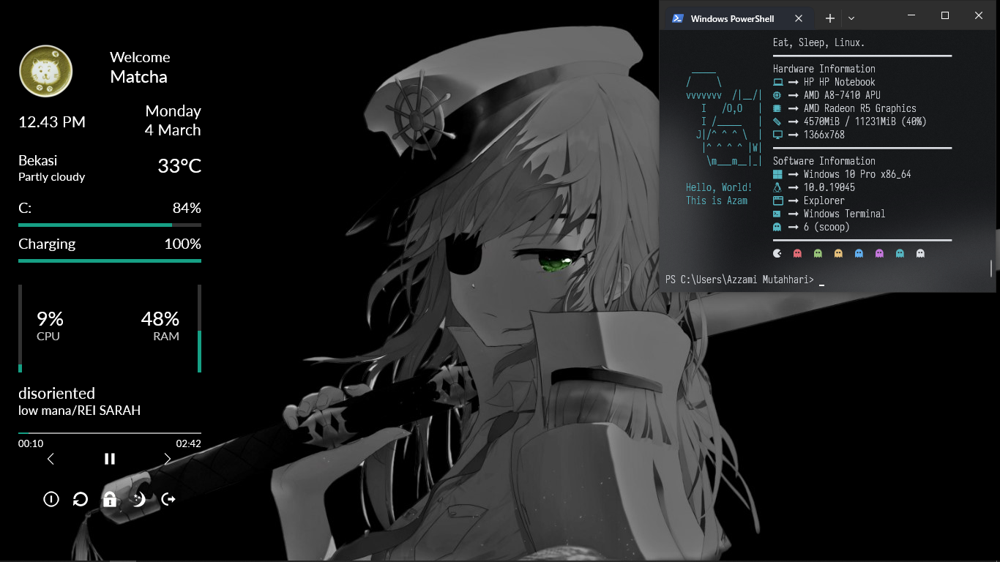

# Conky Rainmeter

>
> ## Conky-like theme configuration for Rainmeter Windows 10/11
>

## Screenshot Tema
<!-- Slideshow container -->

  <!-- Full-width images with number and caption text -->
  

    
  

  

    
  

  

    
  

  <!-- Next and previous buttons -->
  <a class="prev" onclick="plusSlides(-1)">&#10094;</a>
  <a class="next" onclick="plusSlides(1)">&#10095;</a>

 
<!-- The dots/circles -->

  
  
  

## Unduh paket tema di sini
[Link rilis paket](https://github.com/azzamimaf/conkyrainmeter/releases/download/v0.1/v0.1.zip)

## Paket rilis ini berisi :

>
> 1. [Rainmeter](https://www.rainmeter.net/) dan [skin](https://github.com/azzamimaf/conkyrainmeter)
> 2. Wallpaper [Grand Admiral Marina](https://heavenhold.com/heroes/marina/) dari [Guardian Tales](https://guardiantales.com/) 
>

## Cara Pasang Tema
 Video cara memasang tema [di sini](https://youtu.be/3IrMsjhfme0?si=O2tNRr6Z8UiDlHZX)
 
 Ada beberapa bagian :

### A. Pasang Aplikasi Rainmeter
1. Buka folder program
2. Pasang aplikasi Rainmeter pada folder (Klik dua kali, terus ikuti petunjuknya)
3. Restart perangkat jika diminta

### B. Pasang Skin Rainmeter
1. Buka folder rainmeter skin
2. Klik 2 kali untuk memasang skin
3. Klik install pada installer
4. Untuk pengaturan skin rainmeter sesuai selera masing-masing

### C. Pasang Tema Windows
1. Buka Settings
2. Ganti wallpaper dengan gambar dalam paket
3. Ganti warna aksen menjadi otomatis
